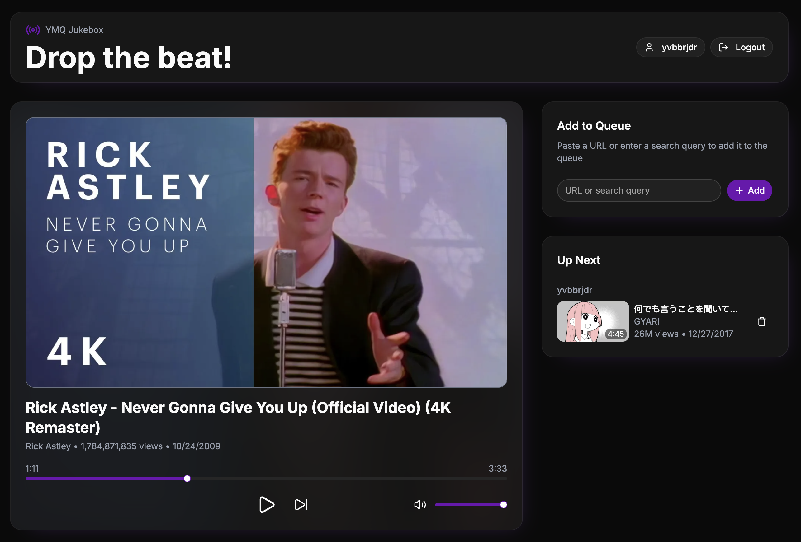

<h1 align="center">YMQ</h1>

<p align="center">yv's media queue</p>



YMQ is a self-hosted, multi-user jukebox. People queue YouTube links (or anything [`yt-dlp`](https://github.com/yt-dlp/yt-dlp) can resolve) from their phones, [`mpv`](https://mpv.io/) plays them on the TV through a connected computer, and everyone gets a fair turn.

## Quick Start

1. Install the following dependencies:
   - [Node.js](https://nodejs.org/)
   - [pnpm](https://pnpm.io/)
   - [mpv](https://mpv.io/)
   - [yt-dlp](https://github.com/yt-dlp/yt-dlp)

2. Clone the repository and install dependencies:

```bash
git clone https://github.com/yvbbrjdr/ymq
cd ymq
pnpm i
```

3. Set up the `.env` files by following the on-screen prompts:

```bash
pnpm setup-env
```

4. Build and serve YMQ:

```bash
pnpm serve
```

5. Open YMQ Jukebox in your browser:

```
http://localhost:3000/
```

or open it from your phone using your computer's IP address:

```
http://xxx.xxx.xxx.xxx:3000/
```

## How It Works

Everyone logs in with only a username and adds songs to their own queue. Playback rotates round-robin across users: if Alice and Bob both have songs queued, it goes Alice → Bob → Alice → Bob, so no one can flood the queue or take over playback. Now playing, position, volume, and the queue stay in sync across every connected browser.

Under the hood, it's three apps in one pnpm workspace:

| App               | What it does                                                                                                                                 |
| ----------------- | -------------------------------------------------------------------------------------------------------------------------------------------- |
| `apps/mpv-server` | Spawns and supervises `mpv`, exposing its control socket over an authenticated WebSocket. Runs on the computer connected to the TV/speakers. |
| `apps/jukebox`    | The web app people actually use: login, queue, playback controls. Talks to `mpv-server` and resolves songs via `yt-dlp`.                     |
| `apps/setup`      | The CLI behind `pnpm setup-env`: detects your `mpv`/`yt-dlp`/browser installs and writes the `.env` files.                                   |

```
Browser  <-WS->  jukebox (Next.js)  <-WS->  mpv-server (Hono)  <-UNIX Domain Socket->  mpv
```

## Development

After installing dependencies and setting up the `.env` files, start both apps in development mode:

```bash
pnpm dev
```

You can also run them individually:

```bash
pnpm dev:mpv-server
pnpm dev:jukebox
```

Before committing changes, run:

```bash
pnpm lint
pnpm format
```

## Configuration

### `apps/mpv-server/.env`

| Variable                      | Default             | Description                                     |
| ----------------------------- | ------------------- | ----------------------------------------------- |
| `HOST`                        | `::1`               | Interface to bind to (loopback only by default) |
| `PORT`                        | `8678`              | Port for the WebSocket server                   |
| `API_KEY`                     | `your-api-key-here` | Bearer token required to connect to `/ws`       |
| `MPV_BINARY_PATH`             | `mpv`               | Path to the `mpv` binary                        |
| `MPV_SOCKET_PATH`             | `/tmp/mpv.sock`     | IPC socket that mpv listens on                  |
| `YT_DLP_BINARY_PATH`          | `yt-dlp`            | Path to `yt-dlp`, passed to mpv's `ytdl_hook`   |
| `YT_DLP_COOKIES_FROM_BROWSER` | —                   | Browser to pull cookies from                    |

### `apps/jukebox/.env`

| Variable                      | Default                  | Description                               |
| ----------------------------- | ------------------------ | ----------------------------------------- |
| `HOST`                        | `::`                     | Interface to bind to                      |
| `PORT`                        | `3000`                   | Port for the web app                      |
| `MPV_SERVER_URL`              | `ws://localhost:8678/ws` | WebSocket URL of `mpv-server`             |
| `MPV_SERVER_API_KEY`          | `your-api-key-here`      | Must match `mpv-server`'s `API_KEY`       |
| `YT_DLP_BINARY_PATH`          | `yt-dlp`                 | Used to resolve metadata for queued items |
| `YT_DLP_COOKIES_FROM_BROWSER` | —                        | Same as above                             |

## A Note on Trust

There is no real auth in the jukebox UI: a username is just a label, with no password or session behind it. Anyone who can reach the page can control playback or change the queue. YMQ is built for trusted home/LAN use (a household, a party), not the open Internet.

## License

[BSD 3-Clause](LICENSE)
